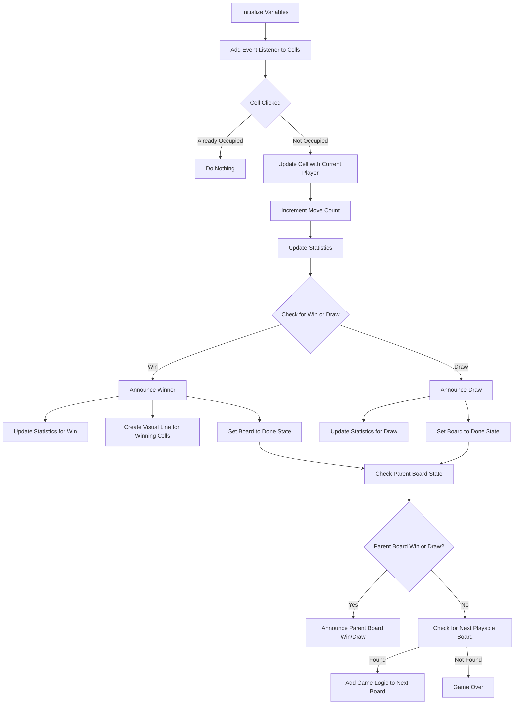
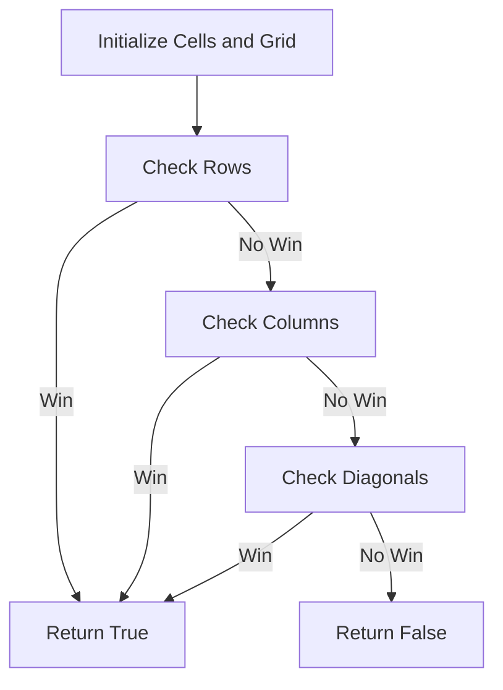

# UNLIMITED Tic-Tac-Toe

UNLIMITED Tic-Tac-Toe is an enhanced version of the classic Tic-Tac-Toe game, featuring customizable board sizes and nested boards for a more challenging and strategic experience. This project is built using HTML, CSS, and JavaScript, with a focus on clean code and modern web development practices.

<h2 style="text-align: center;font-size: 2rem;font-weight: bolder;">UNLIMTED
<table style="margin: 1rem auto;" aria-label="Tic-Tac-Toe Title Grid">
   <tr>
       <td>Tic</td>
       <td></td>
       <td></td>
   </tr>
   <tr>
       <td></td>
       <td>Tac</td>
       <td></td>
   </tr>
   <tr>
       <td></td>
       <td></td>
       <td>Toe</td>
   </tr>
</table>
</h2>

## Features

- **Customizable Board Size**: Play on boards of any size (e.g., 3x3, 4x4, etc.).
- **Nested Boards**: Play with nested boards for a more complex and strategic game.
- **Responsive Design**: The game is fully responsive and works on all devices.
- **Interactive UI**: Smooth animations and transitions for a better user experience.
- **Statistics Tracking**: Track wins, draws, and moves for each player.
- **Zoom Functionality**: Zoom in and out of the game board for better visibility.

## How to Play

1. **Start the Game**:
   - Enter the desired board size and nested level on the homepage.
   - Click "START NOW" to begin the game.

2. **Gameplay**:
   - Players take turns placing their marks (X or O) on the board.
   - The goal is to get a straight line of your marks (horizontally, vertically, or diagonally) to win a board.
   - If a board is won or drawn, the game moves to the next available nested board.

3. **Winning the Game**:
   - The player who wins the most nested boards wins the game.
   - If all boards are filled and no player has a majority, the game ends in a draw.

4. **Controls**:
   - **Restart Game**: Reset the entire game.
   - **Reset Board**: Clear the current board and start over.
   - **Exit Game**: Return to the homepage.
   - **Zoom**: Toggle zoom to focus on the current board.

## Setup

To run this project locally, follow these steps:

1. **Clone the Repository**:
    ```bash
    git clone https://github.com/AlphaBrate/tic-tac-toe
    cd tic-tac-toe
    ```

2. **Open the Project**:
    - Open the `index.html` file in your browser through `Live Server` to start the game.

3. **Customize the Game**:
    - Modify the `nested` and `size` parameters in the URL to customize the game:
      ```
      /app/?nested=2&size=3
      ```
      - `nested`: The number of nested boards.
      - `size`: The size of each board (e.g., 3 for a 3x3 board).

## Code Structure

- **HTML**: The structure of the game is defined in `index.html`.
- **CSS**: Styling and animations are handled in `css/style.css` and `css/game.css`.
- **JavaScript**: Game logic and interactivity are implemented in `js/game.js` and `js/app.js`.

## Technical Details & Algorithms

### `addGameLogic(deepest, nested, size)`

This function adds the main game logic for a Tic-Tac-Toe game to the provided HTML elements.

1. **Initialize Cells and Current Player:**
   - Selects all cells within the deepest board element and sets the current player to 'X'.

2. **Event Listener for Each Cell:**
   - Adds an event listener to each cell to handle a click event.
   - Updates the current player's symbol (cross or circle) on the board.

3. **Handling Cell Clicks:**
   - Checks if the cell is already occupied.
   - Updates the cell with the current player's symbol.
   - Increments the move count.

4. **Updating Statistics:**
   - Tracks moves and updates statistics for draws and wins.

5. **Check for Win or Draw:**
   - Uses `checkWin()` to check if the current player has won.
   - If a win is detected, announces the winner and updates statistics.
   - Creates a visual line to indicate the winning cells.
   - Sets the parent board to a 'done' state.

6. **Recursive Logic for Nested Boards:**
   - Recursively checks and updates the state of parent boards.
   - Handles the logic for nested boards.

#### Flow Chart



### `checkWin(board, player, size)`

This function checks if a player has won the game on a given board.

1. **Initialize Cells and Grid:**
   - Selects all cells within the board and converts the NodeList to a 2D array `grid` for easier checking.
   - This 2D array represents the board's state, storing which player occupies each cell.

2. **Check Rows:**
   - Iterates through each row of the grid.
   - If all cells in a row are occupied by the current player, returns `true`, indicating a win.

3. **Check Columns:**
   - Iterates through each column of the grid.
   - If all cells in a column are occupied by the current player, returns `true`, indicating a win.

4. **Check Diagonals:**
   - Checks both primary and secondary diagonals.
   - If all cells in either diagonal are occupied by the current player, returns `true`, indicating a win.

5. **Return False if No Win:**
   - If none of the rows, columns, or diagonals meet the win conditions, returns `false`, indicating no win.

#### Flow Chart



## Dependencies

- **pujs**: A lightweight JavaScript library for popups and alerts by [AlphaBrate](https://alphabrate.github.io/).

## Contributing

Contributions are welcome! If you'd like to contribute, please follow these steps:

1. **Fork the repository**.
2. **Create a new branch** for your feature or bugfix.
3. **Commit your changes** and push to your branch.
4. **Submit a pull request**.

## License

This project is licensed under the APEL License. See the `LICENSE` file for details.

## Acknowledgments

- Inspired by the classic Tic-Tac-Toe game.
- Built with modern web technologies for a seamless user experience.
- Built by ReTrn from [AlphaBrate](https://alphabrate.github.io/), 2025.

**Enjoy playing UNLIMITED Tic-Tac-Toe! 🎮**

(C) 2025 AlphaBrate.